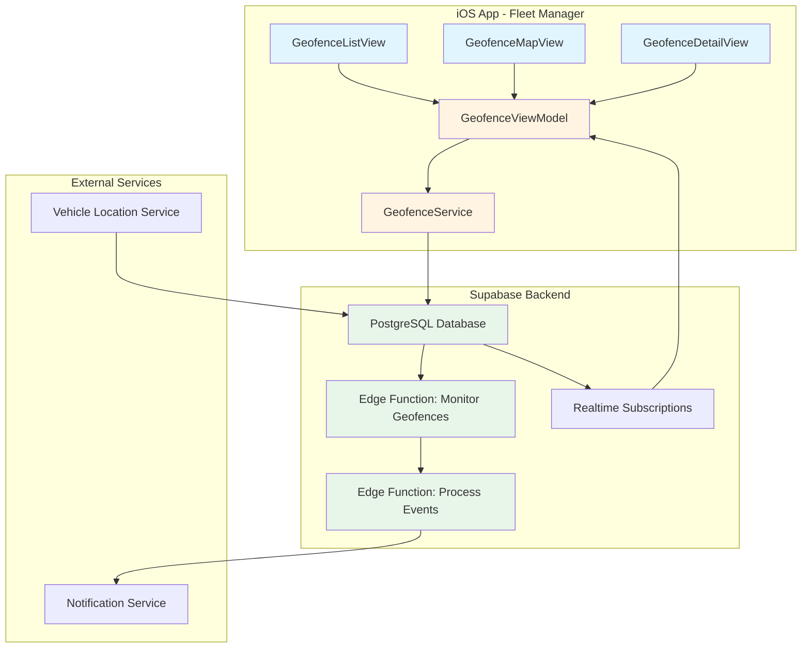

# Design Document: Geofencing Management

## Overview

The Geofencing Management feature enables fleet managers to create, manage, and monitor geographic boundaries (geofences) for vehicles in the Fleet Management System. The system provides automated detection of vehicle entry and exit events across three geofence types: depot, delivery, and restricted zones. This design follows the existing iOS SwiftUI + Supabase architecture pattern used throughout the Fleet Management System.

### Key Design Decisions

1. **Haversine Formula for Distance Calculation**: Use the haversine formula for calculating distances between vehicle coordinates and geofence centers, providing accurate results for the required radius ranges (50-10,000 meters).

2. **Supabase Edge Functions for Monitoring**: Implement geofence monitoring as Supabase Edge Functions triggered by vehicle location updates, ensuring scalable real-time processing without iOS app dependency.

3. **MapKit Integration**: Leverage iOS MapKit for geofence visualization and creation, providing native map interaction patterns familiar to iOS users.

4. **Event-Driven Architecture**: Use database triggers and Edge Functions to create an event-driven system that automatically processes location updates and generates notifications.

5. **Fleet Manager-Only Scope**: This phase focuses exclusively on fleet manager functionality, with driver features deferred to a future phase.

## Architecture

### System Components



### Data Flow

1. **Geofence Creation Flow**:
   - Fleet Manager interacts with GeofenceMapView to select location
   - GeofenceViewModel validates input and calls GeofenceService
   - GeofenceService inserts record into Supabase `geofences` table
   - Realtime subscription updates GeofenceViewModel

2. **Vehicle Monitoring Flow**:
   - Vehicle Location Service updates `vehicle_locations` table
   - Database trigger invokes Edge Function: Monitor Geofences
   - Edge Function calculates distances using haversine formula
   - Edge Function detects entry/exit events and inserts into `geofence_events` table
   - Edge Function calls Notification Service for alerts

3. **Event History Flow**:
   - Fleet Manager views GeofenceDetailView
   - GeofenceViewModel fetches events from `geofence_events` table
   - Events displayed with filtering and export capabilities

## Components and Interfaces

### iOS SwiftUI Components

#### 1. GeofenceListView
**Purpose**: Display all geofences with filtering and search capabilities

**Interface**:
```swift
struct GeofenceListView: View {
    @StateObject private var viewModel: GeofenceViewModel
    @State private var searchText: String = ""
    @State private var selectedType: GeofenceType? = nil
    @State private var showingCreateSheet: Bool = false
    
    var body: some View
}
```

**Responsibilities**:
- Display list of geofences with name, type, and creation date
- Provide search and filter functionality
- Navigate to detail view on selection
- Present create geofence sheet

#### 2. GeofenceMapView
**Purpose**: Visualize geofences on a map and enable creation/editing

**Interface**:
```swift
struct GeofenceMapView: View {
    @StateObject private var viewModel: GeofenceViewModel
    @State private var region: MKCoordinateRegion
    @State private var selectedGeofence: Geofence?
    @State private var isCreatingGeofence: Bool = false
    
    var body: some View
}
```

**Responsibilities**:
- Display map with geofence overlays (circles)
- Handle tap gestures for geofence creation
- Show geofence radius visually
- Support drag-to-adjust radius
- Display vehicle markers within geofences

#### 3. GeofenceDetailView
**Purpose**: Show detailed information about a specific geofence

**Interface**:
```swift
struct GeofenceDetailView: View {
    let geofence: Geofence
    @StateObject private var viewModel: GeofenceViewModel
    @State private var showingEditSheet: Bool = false
    @State private var showingDeleteAlert: Bool = false
    @State private var selectedDateRange: DateRange = .last7Days
    
    var body: some View
}
```

**Responsibilities**:
- Display geofence properties (name, location, radius, type)
- Show assigned vehicles
- Display event history with filtering
- Provide edit and delete actions
- Export event history as CSV

#### 4. GeofenceCreateEditView
**Purpose**: Create or edit geofence properties

**Interface**:
```swift
struct GeofenceCreateEditView: View {
    @Environment(\.dismiss) private var dismiss
    @ObservedObject var viewModel: GeofenceViewModel
    @State private var name: String = ""
    @State private var latitude: Double = 0.0
    @State private var longitude: Double = 0.0
    @State private var radius: Double = 100.0
    @State private var type: GeofenceType = .depot
    @State private var selectedVehicles: Set<UUID> = []
    @State private var showingMapPicker: Bool = false
    
    let mode: Mode
    let existingGeofence: Geofence?
    
    enum Mode {
        case create
        case edit
    }
    
    var body: some View
}
```

**Responsibilities**:
- Validate input fields
- Show map picker for location selection
- Display radius slider with visual feedback
- Allow vehicle assignment selection
- Handle save/update operations

#### 5. VehicleGeofenceStatusView
**Purpose**: Display current geofence status for vehicles

**Interface**:
```swift
struct VehicleGeofenceStatusView: View {
    @StateObject private var viewModel: GeofenceViewModel
    let vehicleId: UUID
    
    var body: some View
}
```

**Responsibilities**:
- Show which geofences vehicle is currently inside
- Display entry timestamps
- Update in real-time via subscriptions

### View Models

#### GeofenceViewModel
**Purpose**: Manage geofence state and business logic

**Interface**:
```swift
@MainActor
final class GeofenceViewModel: ObservableObject {
    @Published private(set) var geofences: [Geofence] = []
    @Published private(set) var events: [GeofenceEvent] = []
    @Published private(set) var vehicleStatuses: [UUID: [GeofenceStatus]] = [:]
    @Published var isLoading: Bool = false
    @Published var errorMessage: String?
    @Published var successMessage: String?
    
    private let service: GeofenceService
    private var realtimeSubscription: Task<Void, Never>?
    
    init(service: GeofenceService = GeofenceService())
    
    // CRUD Operations
    func loadGeofences() async
    func createGeofence(name: String, latitude: Double, longitude: Double, 
                       radius: Double, type: GeofenceType) async
    func updateGeofence(_ geofence: Geofence) async
    func deleteGeofence(_ geofence: Geofence) async
    
    // Assignment Operations
    func assignVehicles(_ vehicleIds: [UUID], to geofenceId: UUID) async
    func removeVehicleAssignment(vehicleId: UUID, from geofenceId: UUID) async
    func loadAssignedVehicles(for geofenceId: UUID) async -> [Vehicle]
    
    // Event Operations
    func loadEvents(for geofenceId: UUID, dateRange: DateRange) async
    func loadVehicleStatus(for vehicleId: UUID) async
    func exportEvents(_ events: [GeofenceEvent]) -> URL?
    
    // Validation
    func validateGeofence(name: String, latitude: Double, longitude: Double, 
                         radius: Double) -> ValidationResult
    func checkOverlaps(latitude: Double, longitude: Double, 
                      radius: Double, excluding: UUID?) async -> [Geofence]
    
    // Realtime
    func subscribeToGeofenceUpdates()
    func unsubscribe()
}
```

### Services

#### GeofenceService
**Purpose**: Handle all Supabase database operations for geofences

**Interface**:
```swift
final class GeofenceService {
    private let client: SupabaseClient
    
    init(client: SupabaseClient = SupabaseManager.shared.client)
    
    // CRUD Operations
    func fetchGeofences() async throws -> [Geofence]
    func fetchGeofence(id: UUID) async throws -> Geofence
    func createGeofence(_ geofence: GeofenceInsert) async throws -> Geofence
    func updateGeofence(id: UUID, _ update: GeofenceUpdate) async throws
    func deleteGeofence(id: UUID) async throws
    
    // Assignment Operations
    func assignVehicles(_ vehicleIds: [UUID], to geofenceId: UUID) async throws
    func removeAssignment(vehicleId: UUID, from geofenceId: UUID) async throws
    func fetchAssignedVehicles(for geofenceId: UUID) async throws -> [Vehicle]
    func fetchGeofencesForVehicle(_ vehicleId: UUID) async throws -> [Geofence]
    
    // Event Operations
    func fetchEvents(for geofenceId: UUID, from startDate: Date, 
                    to endDate: Date) async throws -> [GeofenceEvent]
    func fetchVehicleStatus(for vehicleId: UUID) async throws -> [GeofenceStatus]
    
    // Overlap Detection
    func findOverlappingGeofences(latitude: Double, longitude: Double, 
                                 radius: Double, excluding: UUID?) async throws -> [Geofence]
}
```

### Supabase Edge Functions

#### monitor-geofences
**Purpose**: Process vehicle location updates and detect geofence events

**Trigger**: Database trigger on `vehicle_locations` INSERT/UPDATE

**Logic**:
```typescript
// Pseudocode
async function monitorGeofences(locationUpdate: VehicleLocation) {
  // 1. Fetch all geofences assigned to this vehicle
  const assignedGeofences = await fetchAssignedGeofences(locationUpdate.vehicle_id);
  
  // 2. Calculate distances using haversine formula
  for (const geofence of assignedGeofences) {
    const distance = haversineDistance(
      locationUpdate.latitude,
      locationUpdate.longitude,
      geofence.latitude,
      geofence.longitude
    );
    
    const isInside = distance <= geofence.radius;
    const wasInside = await checkPreviousStatus(locationUpdate.vehicle_id, geofence.id);
    
    // 3. Detect entry event
    if (isInside && !wasInside) {
      await createEvent({
        type: 'entry',
        vehicle_id: locationUpdate.vehicle_id,
        geofence_id: geofence.id,
        timestamp: locationUpdate.timestamp,
        latitude: locationUpdate.latitude,
        longitude: locationUpdate.longitude
      });
      
      await sendNotification(geofence, 'entry', locationUpdate.vehicle_id);
    }
    
    // 4. Detect exit event
    if (!isInside && wasInside) {
      const entryEvent = await findLastEntryEvent(locationUpdate.vehicle_id, geofence.id);
      const dwellTime = locationUpdate.timestamp - entryEvent.timestamp;
      
      await createEvent({
        type: 'exit',
        vehicle_id: locationUpdate.vehicle_id,
        geofence_id: geofence.id,
        timestamp: locationUpdate.timestamp,
        latitude: locationUpdate.latitude,
        longitude: locationUpdate.longitude,
        dwell_time: dwellTime
      });
      
      await sendNotification(geofence, 'exit', locationUpdate.vehicle_id, dwellTime);
    }
  }
}

function haversineDistance(lat1: number, lon1: number, lat2: number, lon2: number): number {
  const R = 6371000; // Earth radius in meters
  const φ1 = lat1 * Math.PI / 180;
  const φ2 = lat2 * Math.PI / 180;
  const Δφ = (lat2 - lat1) * Math.PI / 180;
  const Δλ = (lon2 - lon1) * Math.PI / 180;
  
  const a = Math.sin(Δφ / 2) * Math.sin(Δφ / 2) +
            Math.cos(φ1) * Math.cos(φ2) *
            Math.sin(Δλ / 2) * Math.sin(Δλ / 2);
  const c = 2 * Math.atan2(Math.sqrt(a), Math.sqrt(1 - a));
  
  return R * c; // Distance in meters
}
```

**Performance Considerations**:
- Process only assigned geofences (not all 500)
- Use spatial indexing on geofence coordinates
- Batch notification sending
- Prioritize restricted geofences for high-priority alerts

#### send-geofence-notification
**Purpose**: Send notifications to fleet managers based on geofence events

**Interface**:
```typescript
interface NotificationRequest {
  geofence_id: string;
  vehicle_id: string;
  event_type: 'entry' | 'exit';
  timestamp: string;
  dwell_time?: number;
}

async function sendGeofenceNotification(request: NotificationRequest) {
  const geofence = await fetchGeofence(request.geofence_id);
  const vehicle = await fetchVehicle(request.vehicle_id);
  const fleetManagers = await fetchFleetManagers();
  
  const priority = geofence.type === 'restricted' ? 'high' : 'normal';
  const message = formatNotificationMessage(geofence, vehicle, request);
  
  for (const manager of fleetManagers) {
    await insertNotification({
      user_id: manager.user_id,
      title: message.title,
      body: message.body,
      priority: priority,
      data: {
        type: 'geofence_event',
        geofence_id: request.geofence_id,
        vehicle_id: request.vehicle_id,
        event_type: request.event_type
      }
    });
  }
}
```

## Data Models

### Geofence
```swift
struct Geofence: Codable, Identifiable {
    let id: UUID
    let name: String
    let latitude: Double
    let longitude: Double
    let radius: Double // meters
    let type: GeofenceType
    let created_at: Date
    let updated_at: Date
    
    enum CodingKeys: String, CodingKey {
        case id = "geofence_id"
        case name
        case latitude
        case longitude
        case radius
        case type
        case created_at
        case updated_at
    }
}

enum GeofenceType: String, Codable, CaseIterable {
    case depot
    case delivery
    case restricted
    
    var displayName: String {
        switch self {
        case .depot: return "Depot"
        case .delivery: return "Delivery"
        case .restricted: return "Restricted"
        }
    }
    
    var icon: String {
        switch self {
        case .depot: return "building.2.fill"
        case .delivery: return "shippingbox.fill"
        case .restricted: return "exclamationmark.triangle.fill"
        }
    }
    
    var color: Color {
        switch self {
        case .depot: return .blue
        case .delivery: return .green
        case .restricted: return .red
        }
    }
}
```

### GeofenceAssignment
```swift
struct GeofenceAssignment: Codable, Identifiable {
    let id: UUID
    let geofence_id: UUID
    let vehicle_id: UUID
    let created_at: Date
    
    enum CodingKeys: String, CodingKey {
        case id = "assignment_id"
        case geofence_id
        case vehicle_id
        case created_at
    }
}
```

### GeofenceEvent
```swift
struct GeofenceEvent: Codable, Identifiable {
    let id: UUID
    let geofence_id: UUID
    let vehicle_id: UUID
    let event_type: EventType
    let timestamp: Date
    let latitude: Double
    let longitude: Double
    let dwell_time: TimeInterval? // seconds, only for exit events
    
    enum CodingKeys: String, CodingKey {
        case id = "event_id"
        case geofence_id
        case vehicle_id
        case event_type
        case timestamp
        case latitude
        case longitude
        case dwell_time
    }
    
    enum EventType: String, Codable {
        case entry
        case exit
    }
    
    var formattedDwellTime: String? {
        guard let dwell = dwell_time else { return nil }
        let hours = Int(dwell) / 3600
        let minutes = (Int(dwell) % 3600) / 60
        
        if hours > 0 {
            return "\(hours)h \(minutes)m"
        } else {
            return "\(minutes)m"
        }
    }
}
```

### GeofenceStatus
```swift
struct GeofenceStatus: Codable {
    let vehicle_id: UUID
    let geofence_id: UUID
    let geofence_name: String
    let entry_timestamp: Date
    let is_inside: Bool
}
```

### Database Schema

#### geofences table
```sql
CREATE TABLE geofences (
    geofence_id UUID PRIMARY KEY DEFAULT gen_random_uuid(),
    name VARCHAR(100) NOT NULL,
    latitude DECIMAL(10, 8) NOT NULL CHECK (latitude >= -90 AND latitude <= 90),
    longitude DECIMAL(11, 8) NOT NULL CHECK (longitude >= -180 AND longitude <= 180),
    radius INTEGER NOT NULL CHECK (radius >= 50 AND radius <= 10000),
    type VARCHAR(20) NOT NULL CHECK (type IN ('depot', 'delivery', 'restricted')),
    created_at TIMESTAMPTZ NOT NULL DEFAULT NOW(),
    updated_at TIMESTAMPTZ NOT NULL DEFAULT NOW()
);

CREATE INDEX idx_geofences_type ON geofences(type);
CREATE INDEX idx_geofences_coordinates ON geofences(latitude, longitude);
```

#### geofence_assignments table
```sql
CREATE TABLE geofence_assignments (
    assignment_id UUID PRIMARY KEY DEFAULT gen_random_uuid(),
    geofence_id UUID NOT NULL REFERENCES geofences(geofence_id) ON DELETE CASCADE,
    vehicle_id UUID NOT NULL REFERENCES vehicles(vehicle_id) ON DELETE CASCADE,
    created_at TIMESTAMPTZ NOT NULL DEFAULT NOW(),
    UNIQUE(geofence_id, vehicle_id)
);

CREATE INDEX idx_assignments_geofence ON geofence_assignments(geofence_id);
CREATE INDEX idx_assignments_vehicle ON geofence_assignments(vehicle_id);
```

#### geofence_events table
```sql
CREATE TABLE geofence_events (
    event_id UUID PRIMARY KEY DEFAULT gen_random_uuid(),
    geofence_id UUID NOT NULL REFERENCES geofences(geofence_id) ON DELETE CASCADE,
    vehicle_id UUID NOT NULL REFERENCES vehicles(vehicle_id) ON DELETE CASCADE,
    event_type VARCHAR(10) NOT NULL CHECK (event_type IN ('entry', 'exit')),
    timestamp TIMESTAMPTZ NOT NULL DEFAULT NOW(),
    latitude DECIMAL(10, 8) NOT NULL,
    longitude DECIMAL(11, 8) NOT NULL,
    dwell_time INTEGER, -- seconds, only for exit events
    created_at TIMESTAMPTZ NOT NULL DEFAULT NOW()
);

CREATE INDEX idx_events_geofence ON geofence_events(geofence_id, timestamp DESC);
CREATE INDEX idx_events_vehicle ON geofence_events(vehicle_id, timestamp DESC);
CREATE INDEX idx_events_timestamp ON geofence_events(timestamp DESC);
```

#### Database Trigger
```sql
CREATE OR REPLACE FUNCTION trigger_monitor_geofences()
RETURNS TRIGGER AS $$
BEGIN
    -- Invoke Edge Function asynchronously
    PERFORM net.http_post(
        url := 'https://[project-ref].supabase.co/functions/v1/monitor-geofences',
        headers := jsonb_build_object(
            'Content-Type', 'application/json',
            'Authorization', 'Bearer ' || current_setting('request.jwt.claims')::json->>'sub'
        ),
        body := jsonb_build_object(
            'vehicle_id', NEW.vehicle_id,
            'latitude', NEW.latitude,
            'longitude', NEW.longitude,
            'timestamp', NEW.timestamp
        )
    );
    
    RETURN NEW;
END;
$$ LANGUAGE plpgsql;

CREATE TRIGGER on_vehicle_location_update
AFTER INSERT OR UPDATE ON vehicle_locations
FOR EACH ROW
EXECUTE FUNCTION trigger_monitor_geofences();
```

## Error Handling

### Validation Errors

**Geofence Creation/Edit**:
- Name length: 3-100 characters → "Geofence name must be between 3 and 100 characters"
- Latitude range: -90 to 90 → "Latitude must be between -90 and 90 degrees"
- Longitude range: -180 to 180 → "Longitude must be between -180 and 180 degrees"
- Radius range: 50-10,000 meters → "Radius must be between 50 and 10,000 meters"

**Network Errors**:
- Connection timeout → "Unable to connect. Please check your internet connection."
- Server error → "Server error occurred. Please try again later."
- Authentication error → "Session expired. Please log in again."

**Permission Errors**:
- Non-fleet manager access → "Access denied. Only fleet managers can manage geofences."

### Error Recovery Strategies

1. **Retry Logic**: Implement exponential backoff for transient network errors
2. **Offline Queue**: Queue geofence operations when offline, sync when connection restored
3. **Optimistic Updates**: Update UI immediately, rollback on server error
4. **User Feedback**: Show clear error messages with actionable steps

### Edge Function Error Handling

```typescript
try {
  await monitorGeofences(locationUpdate);
} catch (error) {
  // Log error for monitoring
  console.error('Geofence monitoring error:', error);
  
  // Insert error record for debugging
  await insertMonitoringError({
    vehicle_id: locationUpdate.vehicle_id,
    error_message: error.message,
    timestamp: new Date()
  });
  
  // Don't throw - allow location update to succeed
  // Monitoring will retry on next location update
}
```

## Testing Strategy

### Unit Tests

**GeofenceViewModel Tests**:
- Test geofence validation logic
- Test overlap detection algorithm
- Test event filtering and date range logic
- Test CSV export formatting
- Test error message generation

**GeofenceService Tests**:
- Mock Supabase client responses
- Test CRUD operations
- Test assignment operations
- Test query construction
- Test error handling

**Haversine Formula Tests**:
- Test distance calculation accuracy
- Test edge cases (poles, date line)
- Test performance with multiple calculations

### Integration Tests

**Database Operations**:
- Test geofence CRUD with real Supabase instance
- Test cascade deletes (geofence → assignments → events)
- Test unique constraints on assignments
- Test index performance

**Edge Function Tests**:
- Test entry event detection
- Test exit event detection
- Test dwell time calculation
- Test notification triggering
- Test performance with 100 vehicles

### UI Tests

**GeofenceListView**:
- Test search functionality
- Test type filtering
- Test navigation to detail view
- Test create geofence flow

**GeofenceMapView**:
- Test geofence visualization
- Test tap-to-create interaction
- Test radius adjustment
- Test vehicle marker display

**GeofenceDetailView**:
- Test event history display
- Test date range filtering
- Test CSV export
- Test edit/delete actions

### Property-Based Testing

This feature is **NOT suitable for property-based testing** because:

1. **Infrastructure Integration**: The feature heavily relies on Supabase database operations, MapKit integration, and external notification services - these are infrastructure concerns best tested with integration tests.

2. **UI Rendering**: Significant portions involve SwiftUI view rendering and map visualization, which are better tested with snapshot tests and UI tests.

3. **Side-Effect Operations**: Core functionality involves database writes, notification sending, and location monitoring - these are side-effect operations without meaningful return values to assert universal properties on.

4. **Configuration and State**: Much of the logic involves configuration validation and state management, which are better tested with example-based unit tests covering specific scenarios.

**Alternative Testing Approach**:
- **Unit tests** for validation logic, distance calculations, and business rules
- **Integration tests** for database operations and Edge Function behavior
- **UI tests** for user interaction flows
- **Snapshot tests** for map visualization rendering
- **Performance tests** for monitoring 100 vehicles with 500 geofences

### Performance Testing

**Monitoring Performance**:
- Test Edge Function execution time < 5 seconds per vehicle
- Test concurrent processing of 100 vehicle updates
- Test query performance with 500 geofences
- Test notification delivery latency < 10 seconds for restricted zones

**UI Performance**:
- Test map rendering with 500 geofence overlays
- Test list scrolling with 500 geofences
- Test event history loading with 10,000+ events

## Implementation Notes

### Phase 1: Database and Backend (Week 1)
1. Create database tables and indexes
2. Implement Edge Function: monitor-geofences
3. Implement Edge Function: send-geofence-notification
4. Set up database trigger on vehicle_locations
5. Test with sample data

### Phase 2: iOS Services and Models (Week 2)
1. Create data models (Geofence, GeofenceEvent, etc.)
2. Implement GeofenceService
3. Implement GeofenceViewModel
4. Add unit tests for service and view model

### Phase 3: iOS UI Components (Week 3)
1. Implement GeofenceListView
2. Implement GeofenceMapView with MapKit integration
3. Implement GeofenceCreateEditView
4. Implement GeofenceDetailView
5. Add UI tests

### Phase 4: Integration and Polish (Week 4)
1. Integrate with existing notification system
2. Add realtime subscriptions
3. Implement CSV export
4. Performance testing and optimization
5. Documentation and user guide

### Future Enhancements (Out of Scope)
- Driver-facing geofence features
- Polygon geofences (currently only circular)
- Geofence scheduling (active only during certain hours)
- Historical heatmaps of vehicle activity
- Machine learning for anomaly detection
- Integration with route optimization

## Dependencies

### iOS Dependencies
- SwiftUI (iOS 15+)
- MapKit
- CoreLocation
- Supabase Swift SDK

### Backend Dependencies
- Supabase PostgreSQL
- Supabase Edge Functions (Deno runtime)
- PostGIS extension (optional, for advanced spatial queries)

### External Services
- Existing Vehicle Location Service
- Existing Notification Service
- Apple Maps (for geocoding and map tiles)

## Security Considerations

1. **Role-Based Access Control**: Verify fleet manager role before allowing geofence management operations
2. **Data Validation**: Validate all input on both client and server side
3. **SQL Injection Prevention**: Use parameterized queries in Edge Functions
4. **Rate Limiting**: Implement rate limits on Edge Functions to prevent abuse
5. **Audit Logging**: Log all geofence CRUD operations for compliance
6. **Data Privacy**: Ensure vehicle location data is only accessible to authorized fleet managers

## Monitoring and Observability

1. **Edge Function Metrics**:
   - Execution time per vehicle
   - Error rate
   - Event detection rate
   - Notification delivery success rate

2. **Database Metrics**:
   - Query performance
   - Table sizes
   - Index usage
   - Connection pool utilization

3. **Application Metrics**:
   - Geofence creation/edit/delete counts
   - Active geofences per vehicle
   - Event history query performance
   - Map rendering performance

4. **Alerts**:
   - Edge Function execution time > 5 seconds
   - Error rate > 5%
   - Notification delivery failure
   - Database connection issues
